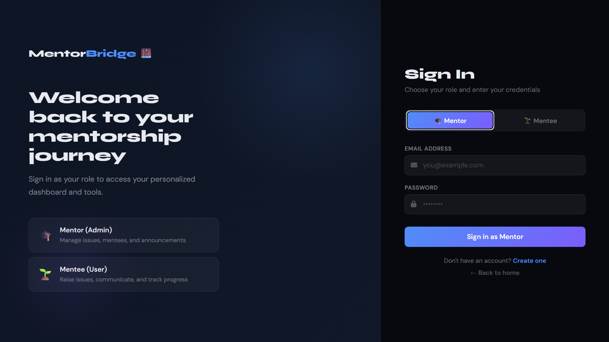
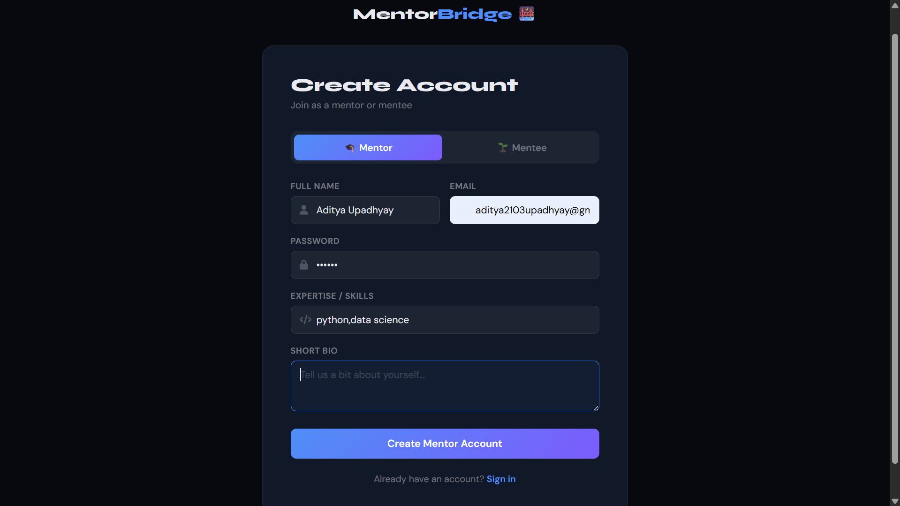
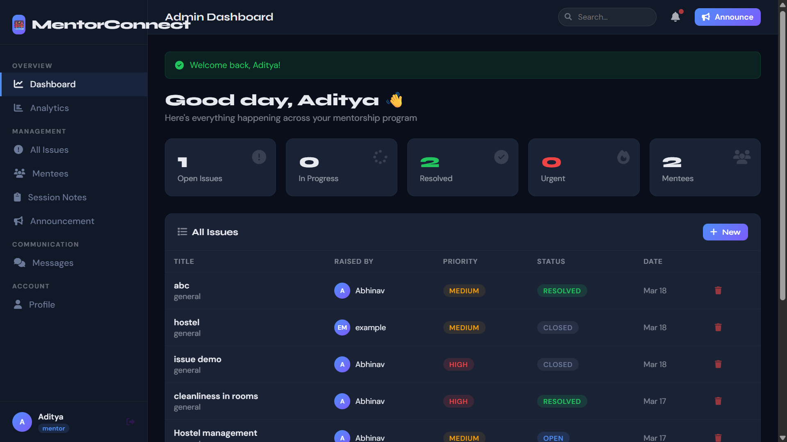
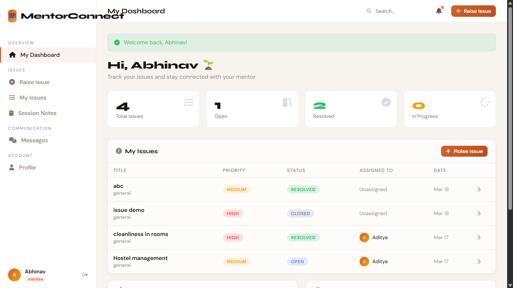
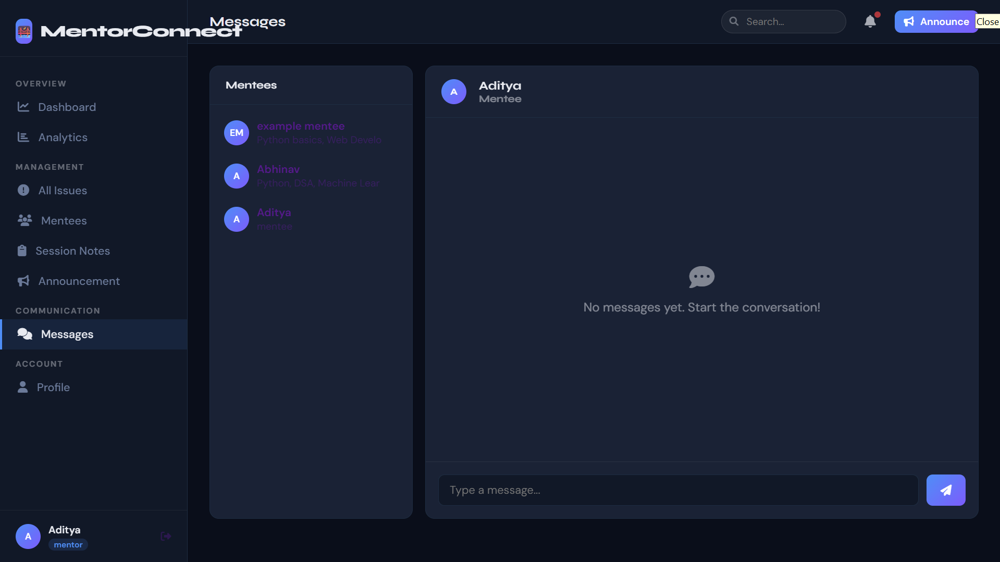
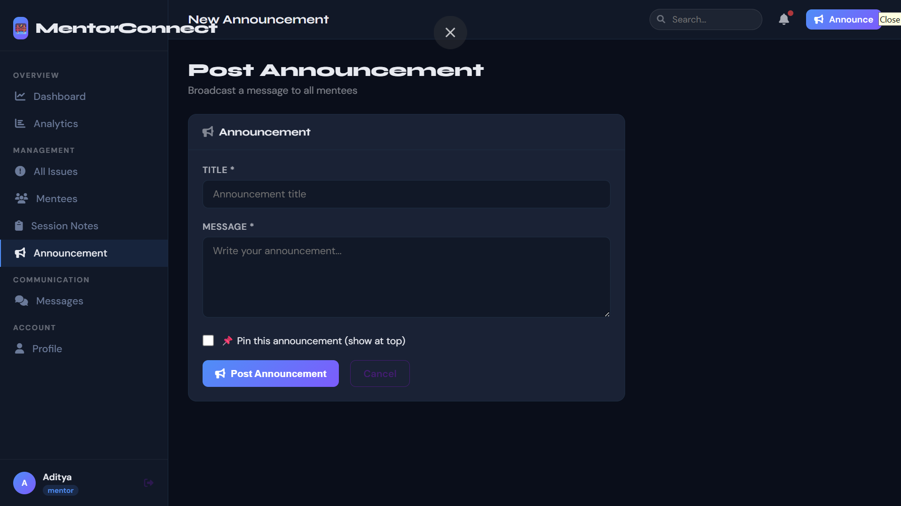

# 🚀 MentorBridge — Mentor-Mentee Connection Platform

## 🔥 Overview

MentorBridge is a full-stack web application built by **Aditya Upadhyay** that enables structured connections between mentors and mentees.
The platform allows users to create accounts, access dashboards, exchange messages, and manage mentorship interactions in an organized way.

---

## ✨ Features

* 🔐 User Authentication (Login / Signup)
* 📝 Account Creation System
* 📊 Centralized Dashboard
* 🧑‍🎓 Mentee Dashboard
* 💬 Messaging System between users
* 📢 Announcement Section
* 🔗 Mentor–Mentee Connection Flow

---

## 🛠 Tech Stack

* **Backend:** Flask (Python)
* **Frontend:** HTML, CSS, JavaScript (Jinja Templates)
* **Database:** SQLite
* **Deployment:** Render

---

## 🗄 Database

* Stores user credentials and profiles
* Supports mentor–mentee interactions
* Managed using SQLite for lightweight deployment

---

## 📸 Screenshots

### 🔐 Login Page



---

### 📝 Account Creation



---

### 📊 Dashboard



---

### 🧑‍🎓 Mentee Dashboard



---

### 💬 Messaging System



---

### 📢 Announcements



---

## 🚀 Live Demo

👉 https://mentor-bridge-iced.onrender.com/login

---

## ⚙️ Installation

```bash id="f9o2xy"
git clone https://github.com/AdityaQQ/mentor_bridge.git
cd mentor_bridge
pip install -r requirements.txt
python app.py
```

---

## 🔑 Environment Variables

```id="v8k2zm"
SECRET_KEY=your_secret_key
```

---

## 🧠 System Flow

1. User signs up or logs in
2. Creates an account profile
3. Accesses dashboard
4. Connects with mentor/mentee
5. Communicates via messaging system
6. Views announcements and updates

---

## 📌 Future Improvements

* Role-based dashboards (mentor vs mentee)
* Real-time chat system
* Smart mentor matching system
* Notification & scheduling system

---

## 👨‍💻 Author

**Aditya Upadhyay**
B.Tech Computer Science
Kalinga Institute of Industrial Technology (KIIT)

---

⭐ Star this repo if you found it useful!
